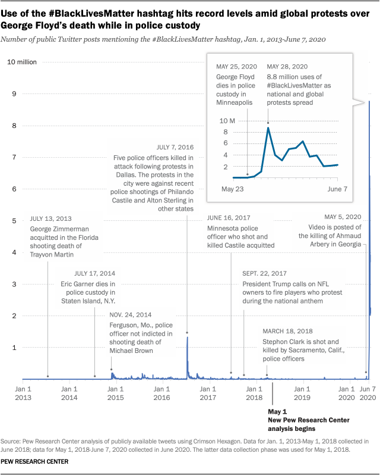

```{r setup, include=FALSE}
library(knitr)
library(rmdformats)
library(rtweet)
library(tidyverse)
library(instaR)
library(tidytext)
library(httpuv)
library(twitteR)
library(lubridate)
library(openssl)
library(httr)
library(wordcloud)
library(gganimate)
library(gifski)
library(forecast)

## Global options
options(max.print="75")
opts_chunk$set(echo=FALSE,
	             cache=TRUE,
               prompt=FALSE,
               tidy=TRUE,
               comment=NA,
               message=FALSE,
               warning=FALSE)
opts_knit$set(width=75)
```
```{r loading fatal police shootings}
fatal_black_police_shootings <- read.csv(
  here::here("Data", "fatal-police-shootings-data.csv"), stringsAsFactors = FALSE) %>%
  filter(race == "B" & date >= "2018-01-01") %>%
  mutate(armed = case_when(is.na(armed) | armed == "undetermined" ~ "unknown",
                           armed == "gun" ~ "gun",
                           TRUE ~ "not a gun"
                           ))

fatal_black_police_shootings <- fatal_black_police_shootings %>%
  mutate(year.month = format(as.Date(fatal_black_police_shootings$date), "%Y-%m"))

fatal_black_police_shootings$year.month <- as.POSIXct(paste0(fatal_black_police_shootings$year.month, "-01-01 00:00:00"))
```


```{r loaddata}
tweets <- read.csv(
  here::here("Data", "blm.csv"), stringsAsFactors = FALSE)
```

***

Over this past year, I have learned quite a bit about myself, about other people, and just about the world in general, and I have noticed some disturbing things. After the [murder of George Floyd](https://en.wikipedia.org/wiki/Murder_of_George_Floyd) and after watching [*The Social Dilemma*](https://www.thesocialdilemma.com/), I have come to believe that although social media does have merit and often times has positive effects, I think it brings a lot of negative ones as well, especially [performative activism](https://medium.com/illumination/the-difference-between-performative-activism-and-genuine-allyship-c1071133d0e0), which "*is a pejorative term referring to activism done to increase one's social capital or capital gain rather than genuine support towards a movement, issues, or causes*". 
<br><br>
Social media was originally created as a way for people to communicate and share with each other from anywhere in the world, but it now seems that it has transitioned into something much more superficial and surface-level. Although many people still do use social media for its intended purpose, a large portion of the youth and younger generations have begun to use social media as a [source of validation](https://kinzoo.com/blog/kids-and-tech/social-media-validation-how-likes-and-hearts-affect-kids). With every social media platform having features such as follower count, likes, and number of comments and shares, it almost seems like the true purpose of social media is for validation. 
<br><br>
Now the connection between the idea of performative activism and people using social media as a source of validation is quite simple. The same reason why someone might post a picture of their expensive car or of them partying in Bora Bora or of an extremely edited photo of themselves is the same reason why someone might post a black square once during an event called [#BlackOutTuesday](https://www.wmagazine.com/story/blackout-tuesday-instagram-post-why-you-should-think-twice) to "show their support for the Black community" and then never do or post anything again concerning the matter. It is all done as an effort to increase their social capital and to gain more followers and likes. [Here](https://swaay.com/performative-activism-silence-protest-allyship) is a great article explaining what performative activism is in more detail and why it is extremely harmful.
<br><br>
Looking at this extremely informative data visualization done by the [Pew Research Center](https://www.pewresearch.org/fact-tank/2020/06/10/blacklivesmatter-surges-on-twitter-after-george-floyds-death/), 
<br><br>
<center>

</center>
<br>
and then also comparing it to this plot of Black people murdered by police, 
<br><br>
```{r animated murders_plot}
(ggplot(fatal_black_police_shootings, aes(x = year.month, fill = armed, col = armed)) +
  geom_histogram(stat = "count") +
  theme_minimal() + 
  theme(axis.text.x = element_text(angle = 90, vjust = 0.5, hjust=1), plot.title = element_text(hjust = 0.5)) +
  labs(title = "Number of Black People Murdered by Police from 2018 to 2021") +
  ylab("Count") + xlab("Year")) + 
  transition_states(year.month, wrap = FALSE) +
  shadow_mark(size = 2)
```
you can see that there is no direct correlation between the peaks. Also, it is important to note that social media has been widely popular for some time now and if we look only at Twitter and its yearly active users,
<br><br>
<center>
](Twitter User Growth.webp)


<div align="left">we can see that the number of active Twitter users did not grow exponentially from 2018 to 2020 and neither did the number of Black people murdered by police, yet there is an enormous jump in tweets using the #BlackLivesMatter hashtag during the weeks following the murder of George Floyd, May 26, 2020 to June 6, 2020. The only time that the number of #BlackLivesMatter tweets in a day exceeded 1 million before the murder of George Floyd was on July 7, 2016 during the protests against the police shootings of Philando Castile and Alton Sterling. 
<br><br>
This illustrates my theory that performative activism is a plague that is born and fostered within social media. Civil rights is not a trend, yet this data says otherwise. Most people only seem to want to be vocal and "show their support" when it is popular to do so. They do not realize that this is a life-long problem that will take generations to fix due to the hundreds of years of damage that has been done to the Black community. It is not as simple as tweeting one time and moving on with your life. 
<br><br>

```{r getting tweets from twitter using Rtweet, eval = F}
tweets <- search_tweets("#BlackLivesMatter OR #blacklivesmatter OR #blm OR #BLM", n = 18000,
                        lang = "en",
                        include_rts = F)
```
To demonstrate this point further, I gathered all of the tweets from the past 9 days that used a form of the #BlackLivesMatter hashtag and excluded retweets. Here is a plot showing the frequency of these tweets each day,

```{r timeline of tweets}
(ts_plot(tweets, "days", col = "coral") +
  labs(x = NULL, y = NULL,
       title = "Frequency of tweets with a form of #BlackLivesMatter hashtag",
       subtitle = paste0(format(as.Date(min(tweets$created_at)), format="%B %d %Y"), " to ", ... =   format(as.Date(max(tweets$created_at)),"%B %d %Y")),
       caption = "Data collected from Twitter's REST API via rtweet") +
  theme_minimal()) +
  geom_point(aes(group = seq_along(time)), col = "red") +
  transition_reveal(time) + 
  ease_aes('linear')
```
```{r save as csv, eval = F}
save_as_csv(tweets, "blmtweets.csv")
```
Now compare this to the data from the Pew Research Center,
<center>

</center>
<br>
and you will see the problem. At first glance, these plots look relatively similar and share a similar shape, but the large difference is the y-axis scale. The plot from the Pew Research Center goes from 0 to 10 million whereas the plot of the tweets from the last few days goes from 0 to 4500. In these past few days, the highest peak was 4300. If you go back in time one year and look at the peak then, it was 8.8 million. That is a 2047% difference, yet nothing significant changed during this past year that would warrant this dramatic decrease in frequency of tweets. Black people are still getting murdered by police regularly. 
<br><br>
In May, 6 Black people were murdered and in April, 19 were murdered. To not reduce these lives and murders to just numbers and statistics, I want to discuss a particular one. 
<br><br>
On May 04, 2021, Lindani Myeni, a 29-year-old unarmed Black man from South Africa, was [murdered by Honolulu police](https://apnews.com/article/honolulu-africa-race-and-ethnicity-racial-injustice-shootings-970f0f6d282eeb178a06b71763d382f9). What is extremely heartbreaking about this story was that Myeni and his wife, Lindsay Myeni, moved their family to Honolulu from predominantly white Denver in January in hopes of finding a safer place to raise their 2 Black children. 
<br><br>
After the murder of Lindani Myeni, there were no mass protests. Social media was not blowing up. People were not caring. #BlackLivesMatter resource accounts and the Black community seemed to be the only people that were upset and outraged. They were and still are the only ones posting information about his murder and the countless other ones in hopes of raising awareness, yet no one else seems to care anymore, that is, not anywhere near as much as they "cared" when George Floyd was murdered. It is almost as if they think the #BlackLivesMatter "trend" is over. 
<br><br>
The only people who actually took physical action and are outspoken in their support for Lindani Myeni and his family are his [countrymen, the South African community](https://www.nytimes.com/2021/05/15/world/africa/honolulu-police-shooting-south-africa.html), which is severely wrong. Black people and almost every other marginalized community have been fighting for their rights and space by themselves since the beginning of time. That is why the entire #BlackLivesMatter movement was such an exciting and hopeful development, because finally, the people who had the privilege and resources to do so were becoming allies to help amplify the voices of Black people and promote reform and change, yet this "allyship" for most was extremely temporary and performative. Most people just posted a few things on social media when they saw everyone else doing it as a way to gain social capital and to be viewed as morally correct by their followers and then they completely forgot about it the next day. 
<br><br>
I am a non-Black POC and I noticed this performative allyship on my personal feed multiple times a day a year ago. I would see someone post a black square or a cute little infograph on how to support #BlackLivesMatter to their story and then a few hours later, I would see it followed by what they had for lunch or a picture of them on vacation and it just made me so incredibly sick to my stomach. I knew the sole reason most of these people were doing these things was for social capital and because they thought it was trendy to do so. I am just so perplexed by how people lack the bare minimum amount of empathy and humanity to realize that human lives are not a trend or a way to get followers. They are human lives. 
<br><br>
A concise quote that demonstrates what a large proportion of the Black community wants to say to white people when they see these things is "You’re here now, but where are you the other 364 days a year when anti-racism isn’t trending? When racism isn’t tucked safely behind the screen in your hand, but right there in front of your face?" (taken from an [article](https://forge.medium.com/performative-allyship-is-deadly-c900645d9f1f) by Holiday Phillips on why performative activism is deadly and what to do instead).
<br><br>
To study the collection of recent tweets that included a form of the #BlackLivesMatter hashtag even further, I extracted the most common words from the tweets and created this visualization.
```{r most common words in the tweets}
words <- tweets %>%
  mutate(text = str_remove_all(text, "&amp;|&lt;|&gt;"),
         text = str_remove_all(text, "\\s?(f|ht)(tp)(s?)(://)([^\\.]*)[\\.|/](\\S*)"),
         text = str_remove_all(text, "[^\x01-\x7F]")) %>% 
  unnest_tokens(word, text, token = "tweets") %>%
  filter(!word %in% stop_words$word,
        !word %in% str_remove_all(stop_words$word, "'"),
        str_detect(word, "[a-z]"),
        !str_detect(word, "^#"),         
        !str_detect(word, "@\\S+")) %>%
  count(word, sort = TRUE)

words %>% 
  with(wordcloud(word, n, random.order = FALSE, max.words = 100, colors = "#FF1770"))
```
The words that appear are not that surprising with the 2 most common words being "black" and "people" and other words such as "lives", "racism" and "matter". A word that was interesting that appeared was "marxist", which was most likely used by conservatives and the right to describe the #BlackLivesMatter movement and its supporters, because that is often the [narrative](https://www.theguardian.com/commentisfree/2020/sep/20/black-lives-matter-rightwing-media) the right likes to push concerning #BlackLivesMatter as a way to stoke fear in the United States and diminish the movement and its efforts. Other common words that appeared are "white", "police", "racist", and "knee" which all most likely refer to the racist police brutality that exists within this world and the "knee" most likely refers to the murder of George Floyd.

The next statistic I wanted to examine was the Twitter accounts that used a form of the #BlackLivesMatter hashtag in their tweets the most. The results were fairly interesting but made sense. 
```{r top tweeters}
knitr::kable(tweets %>% 
  count(screen_name, sort = TRUE) %>%
  top_n(5) %>%
  mutate("screen_name" = paste0("@", screen_name)) %>%
  rename("twitter handle" = screen_name) %>%
  rename("number of tweets with a form of #BlackLivesMatter hashtag" = n ))
```
Every account except [\@RitsyTees](https://twitter.com/RitsyTees) is a bot. [\@tbasharks](https://twitter.com/tbasharks) is a bot that "tweets reports of excessive force and repression at anti BLM demonstrations". [\@oldmainbell](https://twitter.com/OldMainBell) is bot created by a student at Penn State that originally just used to mimic the beloved bell everyone knows and loves on campus and tweet a ding every hour along with a #PennState hashtag, but most likely, after the murder of George Floyd and increased awareness of #BlackLivesMatter, they added #BlackLivesMatter and #JusticeForAll hashtags to the hourly ding tweets. [\@saythenames](https://twitter.com/say_the_names) is bot that periodically tweets the name of a Black person that has been murdered by the police. [\@GreyCrossStudio](https://twitter.com/GreyCrossStudio) is a bot that posts art, and the reason they have tweeted so much using a #BlackLivesMatter hashtag is because they had two art collections named "The Breonna Taylor Protests" and "The Black Lives Matter Archive". Finally, [\@RitsyTees](https://twitter.com/RitsyTees) is a "apparel brand selling quirky designs for holidays or any occasion", and the reason they are on this list is because they are selling Juneteenth t-shirts on Amazon and include the hashtag in their merchandise tweets.
<br><br>
Something else I wanted to examine was the most common hashtags that are used in these tweets besides the #BlackLivesMatter ones and similar to the most common words, the results are not that surprising.
```{r top hashtags}
top_hashtags <- tweets %>% 
  unnest_tokens(hashtag, text, "tweets", to_lower = FALSE) %>%
  filter(str_detect(hashtag, "^#"),
        !(hashtag %in% c("#blm","#BLM", "#BlackLivesMatter", "#blacklivesmatter"))) %>%
  count(hashtag, sort = TRUE) %>%
  top_n(10)

ggplot(top_hashtags, aes(x = reorder(hashtag, n), y = n)) +
  labs(x = NULL, y = NULL,
       title = "Most frequently used hashtags in #BlackLivesMatter tweets",
       subtitle = paste0(format(as.Date(min(tweets$created_at)), format="%B %d %Y"), " to ", ... =   format(as.Date(max(tweets$created_at)),"%B %d %Y")),
       caption = "Data collected from Twitter's REST API via rtweet") +
  geom_bar(fill = "orchid1", stat = "identity") + 
  coord_flip() + theme_minimal()
  
```
The top 3 most common hashtags being #Eritrea, #racism, and #COVID19 is not that suprising, but what is interesting is that similar to "marxist" being one of the most common words, #Antifa is one of the most common hashtags and the reason it is even on this on this plot is the same reason "marxist" was on the other visualization. Something that is nice to see is #StopAsianHate and #Pride2021 being used alongside #BlackLivesMatter frequently, because this highlights one of the most important things I believe every single human should learn and adopt in their life and perspectives, which is [intersectionality](https://www.vox.com/the-highlight/2019/5/20/18542843/intersectionality-conservatism-law-race-gender-discrimination), a term coined by Kimberlé Williams Crenshaw used to "describe how race, class, gender, and other individual characteristics “intersect” with one another and overlap". 

The last thing I wanted to do was use this data from the past few days to construct an ARMA model to predict the frequency of tweets for the next 5 days.
```{r arma prediction}
freq <- as.data.frame(t(t(as.matrix(table(substring(tweets$created_at, 0, 10))))))
freq <- mutate(freq, date = rownames(freq))
names(freq) <- c("n", "date")
freq$date <- as.numeric(substring(freq$date, 9, 11))
twit <- ts(freq$n, start=min(freq$date), end = max(freq$date))
tweetOPT <- auto.arima(twit)
#predict(tweetOPT, n.ahead = 5, se.fit = T)
tweetForecast <- forecast(object = tweetOPT, h = 5)
plot(tweetForecast)
```
The result is a very strange model that does not really show much with the standard error being the size of the entire y-axis and it being a horizontal line. I think this ARMA model would be much more accurate and informative if there was more data to work with, but due to the Twitter API only allowing access to tweets from the past 6-9 days, this is not possible. 
<br><br>
To conclude, performative activism and allyship is extremely prevalent in this day and age and is encouraged by the way social media platforms have been setup and function, and it does not look like it is going anywhere anytime soon.
<br><br>
To steer away from performative activism and to provide true help and reparations to the Black community and every single other marginalized community, I encourage everyone to take the time and energy to have those uncomfortable conversations, to check your privileges, to open your wallets and purses, and to just do your best to keep educating yourself and others around you. There is much more work to be done.
